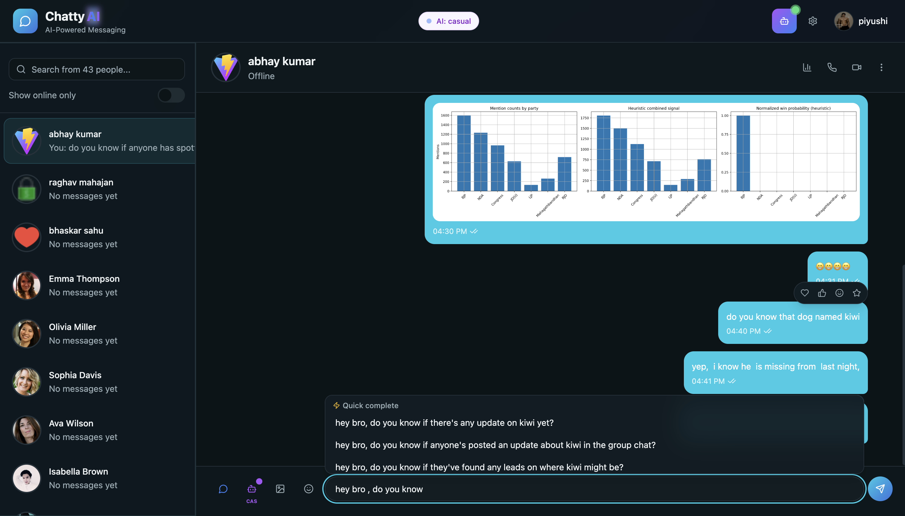
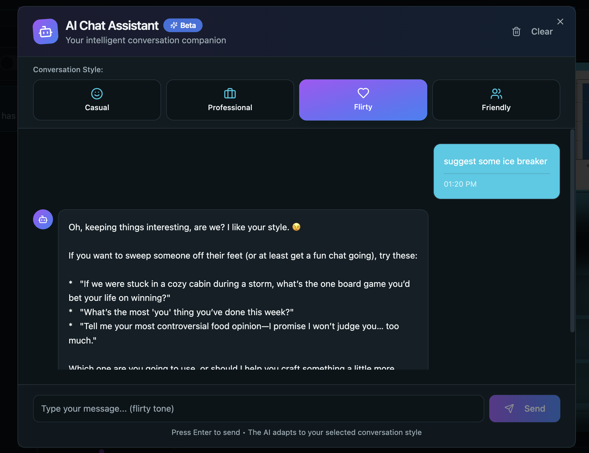
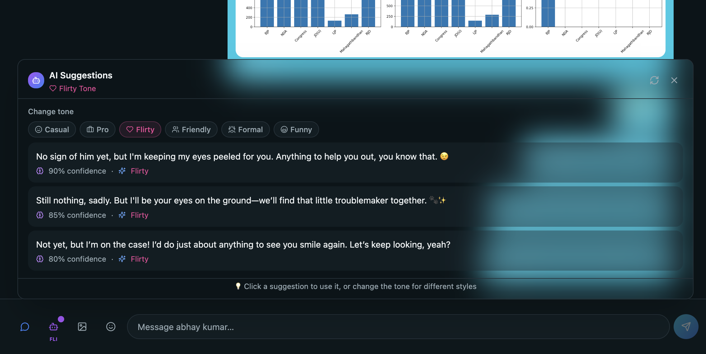
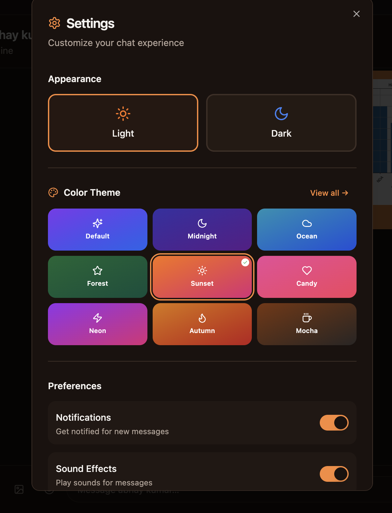
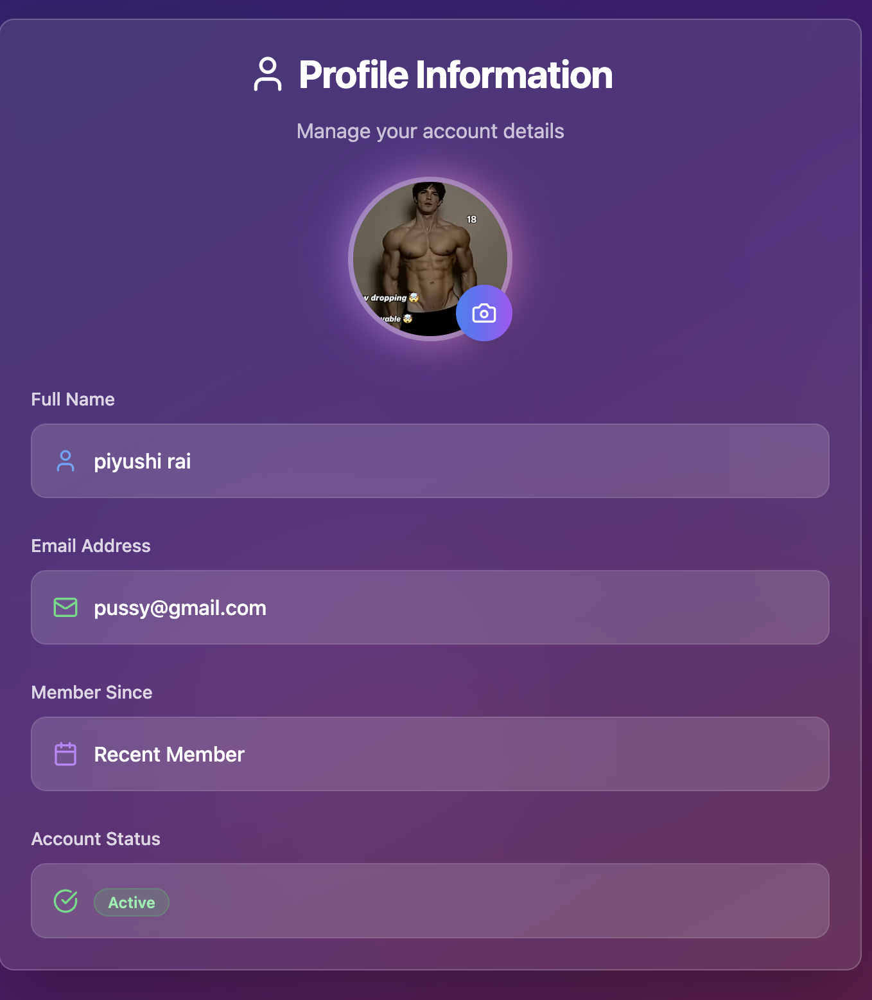
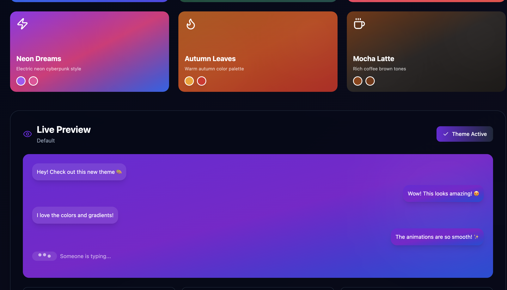
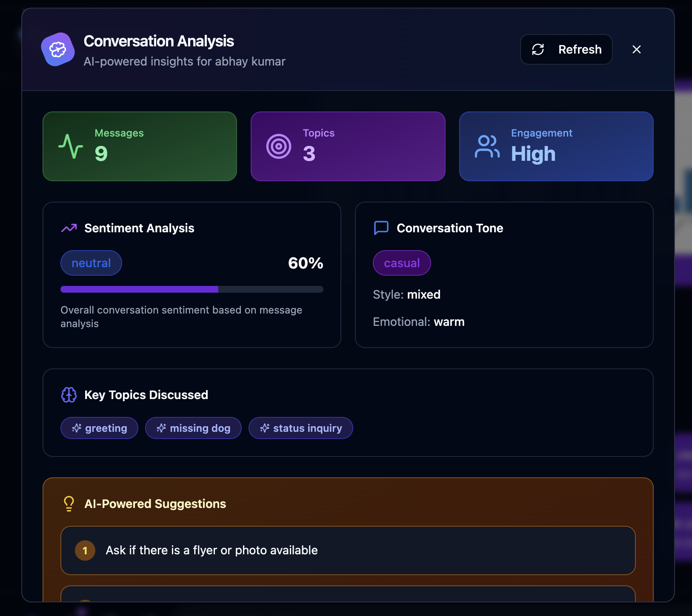

# 🤖 Chatty AI — Full-Stack Real-Time Chat App with AI Superpowers

> A production-grade, real-time messaging application built with **React + TypeScript**, **Node.js / Express**, **MongoDB**, **Socket.IO**, and **Google Gemini AI**. Features AI-powered reply suggestions, live typing autocomplete, conversation analysis, an embedded chatbot, and a rich theme system — all deployed across Vercel, Render, Cloudinary, and MongoDB Atlas.

---

## 🌐 Live Deployment

| Layer | Platform | URL / Notes |
|---|---|---|
| **Frontend** | Vercel | `https://chatty-ai-dusky.vercel.app` |
| **Backend** | Render | `https://chatty-ai-backend.onrender.com` |
| **Database** | MongoDB Atlas | Cloud-hosted MongoDB cluster |
| **Media / Images** | Cloudinary | Profile pictures & chat image uploads |
| **AI API** | Google Gemini Studio | `gemini-2.5-flash-preview-05-20` model |

---

## 📸 Screenshots

### Main Chat Interface — Typing Autocomplete (Quick Complete)


### AI Chatbot Dialog — Flirty Tone


### AI Reply Suggestions Panel — Flirty Tone with Confidence Scores


### Settings Panel — Light/Dark Mode + Color Theme Picker


### Profile Page — Avatar Upload + Account Details


### Theme Picker Page — Live Chat Preview


### Conversation Analysis Modal — Sentiment, Topics & AI Suggestions


---

## 📐 High-Level Architecture

```
┌─────────────────────────────────────────────────────────┐
│                  CLIENT (Vercel)                         │
│   React 18 + TypeScript + Vite                          │
│   Zustand stores │ Socket.IO-client │ Tailwind + shadcn  │
└──────────────┬──────────────────────────────────────────┘
               │  HTTPS REST  +  WebSocket (wss://)
               ▼
┌─────────────────────────────────────────────────────────┐
│                  SERVER (Render)                         │
│   Node.js 20 + Express 4                               │
│   Socket.IO Server │ JWT Auth │ Cloudinary SDK          │
│   Gemini AI Service (axios → Google API)                │
└──────┬───────────────────┬───────────────┬──────────────┘
       │                   │               │
       ▼                   ▼               ▼
┌────────────┐   ┌──────────────────┐   ┌────────────────┐
│  MongoDB   │   │  Cloudinary CDN  │   │ Google Gemini  │
│  Atlas     │   │  (images/media)  │   │  Studio API    │
└────────────┘   └──────────────────┘   └────────────────┘
```

### Data Flow for a Chat Message
1. User types in `MessageInput` → debounced AI typing suggestions fire via REST API
2. User hits Send → `useChatStore.sendMessage()` → `POST /api/messages/send/:id`
3. Server saves to MongoDB, then emits `newMessage` via Socket.IO to the receiver's socket
4. Receiver's `useChatStore` listener appends the message to state → React re-renders

### Data Flow for AI Suggestions
1. User clicks the 🤖 button → `getReplySuggestions()` → `POST /api/chatbot/suggestions/reply`
2. Backend fetches last 30 messages from MongoDB, builds labeled history, calls Gemini API
3. Gemini returns a JSON array of 3 replies → backend parses & returns them
4. Frontend renders them in the `AISuggestions` card; clicking one fills the input

---

## 📁 Project Structure

```
Chatty-AI-main/
├── backened/                        # Node.js + Express API server
│   ├── src/
│   │   ├── index.js                 # App entry point, CORS, middleware, route mounting
│   │   ├── controllers/
│   │   │   ├── auth.controller.js   # signup, login, logout, updateProfile, checkAuth
│   │   │   ├── message.controller.js# getUsersForSidebar, getMessages, sendMessage
│   │   │   └── chatbot.controller.js# getReplySuggestions, getTypingSuggestions,
│   │   │                            #   chatWithBot, analyzeConversation, getAIStatus
│   │   ├── routes/
│   │   │   ├── auth.route.js        # /api/auth/*
│   │   │   ├── message.route.js     # /api/messages/*
│   │   │   └── chatbot.route.js     # /api/chatbot/*
│   │   ├── models/
│   │   │   ├── user.model.js        # Mongoose User schema
│   │   │   └── message.model.js     # Mongoose Message schema
│   │   ├── middlewares/
│   │   │   └── auth.middleware.js   # JWT protectRoute (cookie + Bearer header)
│   │   ├── lib/
│   │   │   ├── db.js                # MongoDB connection via Mongoose
│   │   │   ├── cloudinary.js        # Cloudinary SDK init
│   │   │   ├── socket.js            # Socket.IO server + AI socket events
│   │   │   ├── ai.js                # AIService class (Gemini integration)
│   │   │   └── utils.js             # generateToken() helper
│   │   └── seeds/
│   │       └── user.seed.js         # Seed script for demo users
│   ├── .env.example                 # Environment variable template
│   └── package.json
│
├── frontened2/                      # React + TypeScript SPA
│   ├── src/
│   │   ├── App.tsx                  # Root: auth guard, routing, theme restore
│   │   ├── main.tsx                 # Vite entry, React DOM render
│   │   ├── index.css                # Global CSS variables, all 9 themes
│   │   ├── pages/
│   │   │   ├── Index.tsx            # Main chat layout (sidebar + chat area)
│   │   │   ├── ProfilePage.tsx      # Profile editing + avatar upload
│   │   │   ├── ThemePicker.tsx      # Theme gallery with live preview
│   │   │   └── NotFound.tsx         # 404 page
│   │   ├── components/
│   │   │   ├── AuthPage.tsx         # Login / Signup form
│   │   │   ├── Navbar.tsx           # Top nav: logo, AI toggle, settings, links
│   │   │   ├── FloatingBubblesSidebar.tsx  # Contact list with search + online filter
│   │   │   ├── ChatContainer.tsx    # Message thread, reactions, analysis trigger
│   │   │   ├── ChatArea.tsx         # Layout wrapper for chat
│   │   │   ├── MessageInput.tsx     # Input bar: text, image, emoji, AI, chatbot
│   │   │   ├── AISuggestions.tsx    # Reply suggestions panel with tone selector
│   │   │   ├── TypingSuggestions.tsx# Inline autocomplete chips while typing
│   │   │   ├── AIAnalysis.tsx       # Conversation analysis modal
│   │   │   ├── AIToggle.tsx         # Global AI on/off button
│   │   │   ├── ChatbotDialog.tsx    # Direct AI chatbot dialog
│   │   │   ├── ImageViewer.tsx      # Fullscreen image lightbox
│   │   │   ├── SettingsDialog.tsx   # Settings panel
│   │   │   └── ui/                  # 40+ shadcn/ui components
│   │   ├── stores/
│   │   │   ├── useAuthStore.ts      # Auth state + socket lifecycle
│   │   │   ├── useChatStore.ts      # Messages, users, socket subscription
│   │   │   ├── useAIStore.ts        # AI suggestions, chatbot, analysis, tone
│   │   │   └── useThemeStore.ts     # Persisted theme selection (Zustand persist)
│   │   ├── lib/
│   │   │   ├── api.ts               # Shared fetch wrapper with Bearer token
│   │   │   ├── socket.ts            # SocketService class (thin wrapper)
│   │   │   └── utils.ts             # Tailwind cn() helper, formatMessageTime
│   │   └── hooks/
│   │       ├── use-toast.ts         # Toast hook
│   │       └── use-mobile.tsx       # Responsive breakpoint hook
│   ├── vercel.json                  # SPA rewrite rules (/* → index.html)
│   ├── .env.production              # VITE_API_URL for production build
│   ├── tailwind.config.ts           # Theme color extensions
│   └── vite.config.ts
│
└── deploy.sh                        # Helper deploy script
```

---

## 🔐 Authentication System

### Implementation: JWT + HTTP-only Cookie + Bearer Token (dual strategy)

The authentication system uses a **dual token delivery** pattern to work reliably across cross-origin deployments (Vercel frontend ↔ Render backend).

**Signup / Login flow:**
1. Client sends `POST /api/auth/signup` or `/login` with `{ fullname, email, password }`
2. Server validates input, hashes the password with `bcryptjs` (salt rounds: 10)
3. `generateToken()` in `utils.js` creates a JWT signed with `JWT_SECRET`, expiring in 7 days
4. Token is attached **both** as an HTTP-only `Set-Cookie` header **and** as a custom `X-Auth-Token` response header
5. Frontend `api.ts` `saveToken()` reads `X-Auth-Token` and persists it to `localStorage` under key `chatty_auth_token`
6. All subsequent API calls include `Authorization: Bearer <token>` in the request headers

**Why dual strategy?** HTTP-only cookies alone don't reliably cross origins on Render/Vercel without specific `SameSite=None; Secure` config. The Bearer token stored in `localStorage` acts as the primary mechanism for cross-origin API calls, while the cookie stays as a fallback for same-origin requests.

**Auth middleware (`protectRoute`):**
- Checks `req.cookies.jwt` first, then falls back to `Authorization: Bearer <token>` header
- Verifies JWT signature, fetches the full user object from MongoDB (excluding password)
- Attaches `req.user` for downstream controllers

**Session persistence:**
- On every page load, `useAuthStore.checkAuth()` checks for a stored token and calls `GET /api/auth/check`
- If valid, the user is hydrated into state and the Socket.IO connection is established
- `isCheckingAuth` shows a loading spinner until this resolves

**Logout:**
- Clears the JWT cookie (maxAge: 0), removes localStorage token, disconnects socket

**Profile update:**
- `PUT /api/auth/update-profile` accepts a base64-encoded image string
- Uploads it to Cloudinary and stores the returned `secure_url` in the User document

---

## 💬 Real-Time Messaging (WebSockets)

### Implementation: Socket.IO v4 (server + client)

**Server setup (`socket.js`):**
```
http.createServer(app) → new Server(io, { cors: ... })
```
The `http` server is shared between Express and Socket.IO so both run on the same port.

**Connection & presence tracking:**
- On `connection`, the client sends `userId` via the handshake query string
- Server stores `{ userId → socket.id }` in an in-memory `userSocketMap`
- Broadcasts `getOnlineUsers` (array of all connected user IDs) to every connected client
- On `disconnect`, removes the user from the map and re-broadcasts

**Sending messages (hybrid approach):**
1. REST: `POST /api/messages/send/:receiverId` persists the message to MongoDB
2. Socket emit: after saving, server does `io.to(receiverSocketId).emit("newMessage", message)` — targeted delivery to only the receiver
3. The sender gets the message returned in the REST response and adds it to their own store

**Frontend subscription (`useChatStore`):**
- `subscribeToMessages()` attaches a `socket.on("newMessage", ...)` listener
- Guards against messages from other conversations: only adds the message if `senderId === selectedUser._id`
- `unsubscribeFromMessages()` removes the listener on conversation change

**AI suggestions via WebSocket:**
The socket also handles two AI events for lower-latency delivery:
- `requestReplySuggestions` → fetches DB history, calls Gemini, emits `replySuggestions` back
- `requestTypingSuggestions` → real-time autocomplete, emits `typingSuggestions` back

These duplicate the REST endpoints for scenarios where the client wants push-style delivery without waiting for a response.

---

## 🤖 AI Features (Google Gemini)

### Core Service: `AIService` class (`backened/src/lib/ai.js`)

The `AIService` class encapsulates all Gemini interactions. It uses `axios` to call `https://generativelanguage.googleapis.com/v1beta/models/{model}:generateContent`.

**Model:** `gemini-2.5-flash-preview-05-20` (configurable via `AI_MODEL` env var)

---

### Feature 1: Reply Suggestions


**Endpoint:** `POST /api/chatbot/suggestions/reply`
**Socket event:** `requestReplySuggestions`

How it works:
1. Backend fetches up to 30 recent messages between the two users from MongoDB
2. Builds a **labeled conversation history** string: `"You: Hey!\nAlice: What's up?\n..."`
3. Constructs a prompt including tone instructions, history, and the message to reply to
4. Asks Gemini to return a JSON array of exactly 3 diverse reply strings
5. Parses the JSON (strips markdown fences if present), adds confidence scores (0.9, 0.85, 0.80)
6. Returns the suggestions to the frontend

**Frontend (`AISuggestions.tsx`):**
- Shown in an animated card above the message input
- Displays current tone badge, a refresh button, and 3 clickable suggestion chips
- Clicking a chip fills the message input instantly

---

### Feature 2: Typing Autocomplete


**Endpoint:** `POST /api/chatbot/suggestions/typing`
**Trigger:** User types 3+ characters, debounced at 600ms

How it works:
1. Frontend sends the partial text + recent conversation context
2. Backend fetches the last 10 messages for context
3. Gemini prompt: "Complete this partial message in 3 natural ways: `{partialText}`"
4. Returns 3 full completed message strings

**Frontend (`TypingSuggestions.tsx`):**
- Rendered as small chips directly below the input bar
- Clicking a chip replaces the current input text

---

### Feature 3: Conversation Analysis


**Endpoint:** `POST /api/chatbot/analyze/:receiverId`

How it works:
1. Backend fetches up to 50 messages from the conversation
2. Prompts Gemini to return a structured JSON with:
   - `sentiment`: positive / negative / neutral
   - `tone`: casual / friendly / professional / formal
   - `topics`: array of main topics discussed
   - `suggestions`: array of 3 conversation improvement tips
   - `conversationStyle`: engaging / brief / detailed / mixed
   - `emotionalTone`: warm / neutral / tense / playful
3. Falls back to a keyword-based `performBasicAnalysis()` if Gemini is unavailable

**Frontend (`AIAnalysis.tsx`):**
- Opens as a full-screen modal with animated entry
- Displays sentiment with a progress bar visualization
- Shows topic tags as badges
- Lists improvement suggestions
- Triggered by the chart icon (📊) in the chat header

---

### Feature 4: AI Chatbot


**Endpoint:** `POST /api/chatbot/chat`

How it works:
1. Maintains conversation history on the frontend (`chatbotMessages` in `useAIStore`)
2. Sends the full history (last 10 messages) + new user message to the backend
3. Backend builds a single text prompt with the full history and asks Gemini for a response
4. Returns the assistant's reply

**Frontend (`ChatbotDialog.tsx`):**
- Opens as a `Dialog` (modal)
- Shows message history with user/assistant bubbles and timestamps
- Tone selector (Casual, Professional, Flirty, Friendly) affects AI response style
- Copy button on each AI message
- Clear history button

---

### Tone System

All AI features share a **6-tone system**: `casual`, `professional`, `flirty`, `friendly`, `formal`, `humorous`.

Each tone has:
- A text instruction injected into every Gemini prompt (e.g., "Reply in a relaxed, informal, friendly manner")
- A temperature value (0.4 for formal → 0.9 for flirty/humorous)

The selected tone is stored globally in `useAIStore.selectedTone` and persists across suggestion requests. Changing the tone **automatically re-fetches** suggestions if the panel is open.

**Fallback:** If Gemini is unavailable or returns an error, hardcoded per-tone fallback suggestions are returned so the UI never breaks.

---

### AI Toggle

A global `isAIEnabled` boolean in `useAIStore` gates all AI features. The toggle lives in the `Navbar` (via `AIToggle.tsx`). When disabled:
- No typing suggestions fire
- The reply suggestions button shows an error toast
- The API calls are short-circuited before hitting the network

---

## 🎨 Theme System


### Implementation: CSS Variables + Tailwind + Zustand persist

The app ships with **9 complete themes**, each defined entirely in `index.css` as CSS custom properties on a dedicated class:

| Theme | Class | Description |
|---|---|---|
| Default | `:root` | Purple/blue light+dark system theme |
| Midnight Purple | `.theme-midnight` | Deep indigo/purple, dark |
| Sunset Glow | `.theme-sunset` | Orange/pink/purple warm tones |
| Ocean Breeze | `.theme-ocean` | Cyan/blue cool tones |
| Forest Night | `.theme-forest` | Dark emerald/teal tones |
| Candy Pop | `.theme-candy` | Pink/rose playful tones |
| Neon Dreams | `.theme-neon` | Electric purple/pink cyberpunk |
| Autumn Leaves | `.theme-autumn` | Amber/orange/red warm tones |
| Mocha Latte | `.theme-mocha` | Deep coffee/stone browns |

**How switching works:**
1. User picks a theme on the `ThemePicker` page (animated card gallery with gradient previews)
2. `useThemeStore.setAppTheme(theme)` removes all `theme-*` classes from `document.documentElement` and adds the new one
3. All CSS variables cascade from that root class to every component via Tailwind's `hsl(var(--primary))` pattern
4. The chosen theme is persisted to `localStorage` via `zustand/middleware persist` under key `chatty-app-theme`
5. On every page load, `App.tsx` re-applies the saved theme class so it survives refresh

The Tailwind config extends the default palette with semantic color tokens (`primary`, `secondary`, `background`, etc.) that all map to these CSS variables, ensuring every shadcn/ui component automatically inherits the active theme.

---

## 🖼️ Media & Image Handling

### Implementation: Cloudinary

**Backend (`cloudinary.js`):** Initializes the Cloudinary SDK with `CLOUDINARY_CLOUD_NAME`, `CLOUDINARY_API_KEY`, and `CLOUDINARY_API_SECRET` from environment variables.

**Two upload paths:**
1. **Profile pictures:** `PUT /api/auth/update-profile` accepts a base64 data URL, uploads via `cloudinary.uploader.upload()`, stores `secure_url` on the User document
2. **Chat images:** `POST /api/messages/send/:id` accepts an image field (base64), uploads to Cloudinary, stores the CDN URL in the Message document

**Frontend (image selection in `MessageInput`):**
- File input filtered to `image/*`
- `FileReader.readAsDataURL()` converts the selected file to base64
- Preview shown inline before sending
- 10MB body size limit set on Express (`express.json({ limit: '10mb' })`)

**Image viewer (`ImageViewer.tsx`):**
- Clicking any message image opens a fullscreen lightbox with zoom/pan capability and a download button

---

## 🗄️ Database Design (MongoDB + Mongoose)

### User Model

```
User {
  email:      String (required, unique)
  fullname:   String (required)
  password:   String (required, minlength: 6) — bcrypt hash
  profilePic: String (default: '') — Cloudinary URL
  createdAt:  Date (auto)
  updatedAt:  Date (auto)
}
```

### Message Model

```
Message {
  senderId:   ObjectId → ref: 'User' (required)
  receiverId: ObjectId → ref: 'User' (required)
  text:       String (optional)
  image:      String (optional) — Cloudinary URL
  createdAt:  Date (auto)
  updatedAt:  Date (auto)
}
```

Messages are fetched with a bi-directional query:
```js
Message.find({
  $or: [
    { senderId: myId, receiverId: userId },
    { senderId: userId, receiverId: myId }
  ]
})
```

---

## 🏪 Frontend State Management

### Zustand Stores

**`useAuthStore`** — Authentication & Socket lifecycle
- Holds: `authUser`, `socket`, `onlineUsers`, loading flags
- Manages the entire socket connection: creates it on login, listens for `getOnlineUsers`, destroys it on logout

**`useChatStore`** — Messaging
- Holds: `messages[]`, `users[]`, `selectedUser`, loading flags
- `subscribeToMessages()` / `unsubscribeFromMessages()` toggle the Socket.IO `newMessage` listener
- No persistence — fresh fetch on every conversation open

**`useAIStore`** — All AI features
- Holds: `replySuggestions`, `typingSuggestions`, `analysis`, `chatbotMessages`, `selectedTone`, `isAIEnabled`
- `_lastSuggestionParams` enables automatic re-fetch when tone changes
- `setSelectedTone()` triggers a 50ms-delayed re-fetch if the suggestion panel is open

**`useThemeStore`** — Theme
- Holds: `appTheme`
- Uses `zustand/middleware persist` to survive page refreshes

---

## 🌐 API Reference

### Auth Routes (`/api/auth`)

| Method | Path | Auth | Description |
|---|---|---|---|
| POST | `/signup` | None | Create account, returns user + sets token |
| POST | `/login` | None | Login, returns user + sets token |
| POST | `/logout` | Cookie | Clears JWT cookie |
| PUT | `/update-profile` | JWT | Upload profile picture to Cloudinary |
| GET | `/check` | JWT | Verify auth status, return current user |

### Message Routes (`/api/messages`)

| Method | Path | Auth | Description |
|---|---|---|---|
| GET | `/users` | JWT | Get all users except self (for sidebar) |
| GET | `/:id` | JWT | Get full message history with user |
| POST | `/send/:id` | JWT | Send text and/or image message |

### Chatbot Routes (`/api/chatbot`)

| Method | Path | Auth | Description |
|---|---|---|---|
| POST | `/suggestions/reply` | JWT | Get 3 AI reply suggestions |
| POST | `/suggestions/typing` | JWT | Get 3 autocomplete completions |
| POST | `/chat` | JWT | Chat with the AI assistant |
| POST | `/analyze/:receiverId` | JWT | Analyze conversation sentiment & topics |
| GET | `/status` | JWT | Check AI service availability |

### Socket.IO Events

| Event | Direction | Payload | Description |
|---|---|---|---|
| `getOnlineUsers` | Server → All | `string[]` | Broadcast online user IDs |
| `newMessage` | Server → Receiver | `Message` | Real-time message delivery |
| `requestReplySuggestions` | Client → Server | `{ messageId, receiverId, tone, conversationHistory }` | Request AI reply suggestions |
| `replySuggestions` | Server → Client | `{ suggestions, messageId, tone, timestamp }` | AI suggestions response |
| `requestTypingSuggestions` | Client → Server | `{ partialText, receiverId, tone }` | Request typing autocomplete |
| `typingSuggestions` | Server → Client | `{ suggestions, timestamp }` | Autocomplete response |

---

## 🖥️ Frontend Component Guide

### `App.tsx`
Root component. Checks auth on mount, re-applies saved theme, shows loading spinner, then routes to `AuthPage` or the main app based on `authUser`.

### `AuthPage.tsx`
Animated two-panel layout (branding left, form right on desktop; stacked on mobile). Toggles between login and signup with form validation (minimum 6-char password).

### `FloatingBubblesSidebar.tsx`
Contact list with:
- Real-time search (filters by name)
- Online-only toggle (filters by `onlineUsers` array from socket)
- Sorted by last message time
- Online indicator dot per user
- Last message preview snippet

### `ChatContainer.tsx`
The main message thread. Features:
- Auto-scroll to latest message
- Message timestamps
- Image click-to-expand (opens `ImageViewer`)
- Hover reactions (❤️ 👍 😊 ⭐) — client-side only, max 3 per message
- "Delivered" checkmark (✓✓) on sent messages
- AI Analysis trigger button (📊) in the header

### `MessageInput.tsx`
The bottom input bar. Manages:
- Text input with 600ms debounced typing suggestions
- Image file picker (base64 preview + send)
- Emoji picker (click-outside to close)
- 🤖 button → shows `AISuggestions` panel
- 💬 button → opens `ChatbotDialog`
- Context builder: analyzes recent messages to infer relationship depth and previous topics
- Conversation context sent with every AI request for personalized suggestions

### `Navbar.tsx`
Persistent top bar with: logo, global AI toggle, settings, profile link, themes link, logout.

### `ThemePicker.tsx`
Full-page animated gallery of all 9 themes. Each card shows the gradient, icon, label, and description. Selected theme gets a checkmark. Uses Framer Motion for entrance animations.

---

## ⚙️ Environment Variables

### Backend (`.env`)

```env
# Server
PORT=5001
NODE_ENV=production

# MongoDB Atlas
MONGODB_URI=mongodb+srv://<user>:<pass>@cluster.mongodb.net/chatapp

# JWT
JWT_SECRET=your_super_secret_key

# Cloudinary
CLOUDINARY_CLOUD_NAME=your_cloud_name
CLOUDINARY_API_KEY=your_api_key
CLOUDINARY_API_SECRET=your_api_secret

# Google Gemini AI
# Get your free key at https://aistudio.google.com/app/apikey
GEMINI_API_KEY=AIza...
AI_MODEL=gemini-2.5-flash-preview-05-20
AI_MAX_TOKENS=600
AI_TEMPERATURE=0.8
```

### Frontend (`.env.production`)

```env
VITE_API_URL=https://chatty-ai-backend.onrender.com
```

For local development, create `.env.local`:
```env
VITE_API_URL=http://localhost:5001
```

---

## 🚀 Running Locally

### Prerequisites
- Node.js 20.x
- MongoDB (local or Atlas URI)
- A free [Cloudinary](https://cloudinary.com) account
- A free [Google Gemini API key](https://aistudio.google.com/app/apikey)

### Backend

```bash
cd backened
cp .env.example .env
# Edit .env with your values

npm install
npm run dev         # nodemon on port 5001

# Seed demo users (optional)
npm run seed
```

### Frontend

```bash
cd frontened2
npm install

# Create .env.local
echo "VITE_API_URL=http://localhost:5001" > .env.local

npm run dev         # Vite on port 5173
```

---

## ☁️ Deployment Guide

### Backend → Render

1. Push the `backened/` folder to a GitHub repository
2. Create a new **Web Service** on [render.com](https://render.com)
3. Set:
   - **Build command:** `npm install`
   - **Start command:** `node src/index.js`
   - **Node version:** 20
4. Add all environment variables from the `.env.example` in Render's dashboard
5. The service URL becomes your `VITE_API_URL`

### Frontend → Vercel

1. Push the `frontened2/` folder to GitHub
2. Import the repo in [vercel.com](https://vercel.com)
3. Set **Root Directory** to `frontened2`
4. Add environment variable: `VITE_API_URL=https://your-render-service.onrender.com`
5. The `vercel.json` SPA rewrite rule (`/* → /index.html`) ensures React Router works on direct URL access

### Cloudinary
Sign up at [cloudinary.com](https://cloudinary.com). The free tier provides 25GB storage and 25GB monthly bandwidth — sufficient for development and moderate production use.

### MongoDB Atlas
Create a free M0 cluster at [mongodb.com/atlas](https://mongodb.com/atlas). Whitelist `0.0.0.0/0` for Render's dynamic IPs, or use Render's static outbound IPs if available on your plan.

---

## 🛠️ Tech Stack Summary

### Frontend
| Technology | Version | Purpose |
|---|---|---|
| React | 18.3 | UI framework |
| TypeScript | 5.8 | Type safety |
| Vite | 7.x | Build tool & dev server |
| Zustand | 5.0 | Global state management |
| Socket.IO Client | 4.8 | WebSocket communication |
| Tailwind CSS | 3.4 | Utility-first styling |
| shadcn/ui + Radix UI | latest | Accessible UI components |
| Framer Motion | 12.x | Animations |
| React Router | 6.x | Client-side routing |
| React Hot Toast | 2.x | Notification toasts |
| emoji-picker-react | 4.x | Emoji picker |
| Lucide React | 0.46 | Icon set |

### Backend
| Technology | Version | Purpose |
|---|---|---|
| Node.js | 20.x | Runtime |
| Express | 4.x | HTTP framework |
| Socket.IO | 4.8 | WebSocket server |
| Mongoose | 8.x | MongoDB ODM |
| bcryptjs | 2.4 | Password hashing |
| jsonwebtoken | 9.0 | JWT creation & verification |
| Cloudinary SDK | 2.x | Image upload management |
| axios | 1.x | HTTP client for Gemini API |
| cookie-parser | 1.4 | Cookie parsing middleware |
| cors | 2.8 | Cross-origin resource sharing |
| dotenv | 16.x | Environment variable loading |

---

## 🔒 Security Notes

- Passwords are **never stored in plain text** — bcrypt with salt rounds 10
- JWTs expire in 7 days and are verified on every protected request
- HTTP-only cookies prevent JavaScript access to the cookie token
- CORS is restricted to known origins (`*.vercel.app` wildcard covers Vercel preview deployments)
- Cloudinary upload errors are caught and returned as `502` without leaking SDK internals
- The `protectRoute` middleware runs before every `/api/messages` and `/api/chatbot` route

---

## 📝 Known Limitations & Future Improvements

- **Message reactions** are client-side only (not persisted to DB)
- **Typing indicators** ("Alice is typing...") are not implemented
- **Group chats** are not supported — only 1-to-1 conversations
- **Message deletion / editing** is not implemented
- **Push notifications** are not implemented for background tabs
- The `userSocketMap` is in-memory — horizontal scaling would require Redis Pub/Sub
- AI analysis improvement suggestions are static per tone and not personalized to the specific conversation content over time